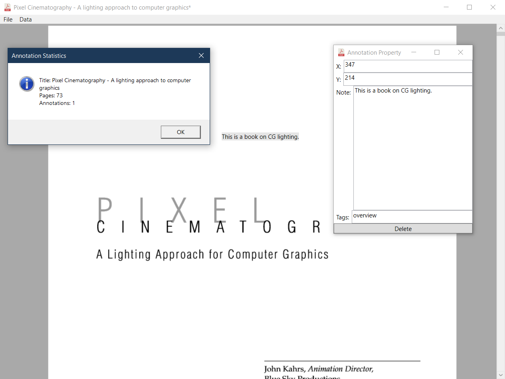

# PDF Apprentice - Motivation

Uses **Windows 10 APIs** to render a PDF Document as **image** in WPF, planned to support rudimentary **text annotation** and **entity management**. This project is directly inspired by [Lander Verhack](https://blogs.u2u.be/lander/)'s post [Creating a PDF Viewer in WPF using Windows 10 APIs](https://blogs.u2u.be/lander/post/2018/01/23/Creating-a-PDF-Viewer-in-WPF-using-Windows-10-APIs). The goal is to provide a simple way to handle **knowledge management** *from within a PDF context* - partly due to the modern "PDF culture" - if you know what I mean.

This program serves one single purpose: provides a **simple way** to add annotations to PDFs and allow **data interoperation**, as such it doesn't intend to have any heavy-weight functionalities. The annotations are saved as an external metadata file with the same name as the PDF in YAML format; It supports direct export to KMD format. This program can be used as part of a process along the *personal note/data management pipeline*.

# Screenshot

# Task List

**Current**

None.

**Future Features**

1. Allow arbitary taggable page-level Ink Canvas to be associated with each page (for **highlight**, sketch and draft purpose, not for annotation purpose per-se, thus the whole thing is managed as a single entity).
2. (Usability) Add configuration to configure next-open image size (mostly width); Also we might need horizontal scroll bar for items container
4. (UI) Annotation property window notes text input should have a max width so horizontal scroll bar can show;
5. (UI) Add deliberate max width to annotation widget (e.g. 500 px).

**Implemented/Solved**

1. (Basic function) Allow adding text annotations as an **entity**, each entity for now just need to contain *content*, along side optional *tags* string (*notice we don't have the concept of a **title** because it's dumb and better used as a tag if really really needed*). Entities contain **location information** and it's relative to **owner page** (subject to PDF page image resolution difference but that's as good as we can do). Pages are identified by **page ID**, starting from *0*, for a particular document.
	* (Implementation) Entities on page are only for display purpose, it's edited in seperate window.
2. (Improvement, bug fix) When save windows title is not updating save status (the `*` is still present).
3. (Bug fix) Clear annoations list when loading new file.
4. (Export, format) Export into Knowledge Markdown plain text.
5. (UI) Don't show Annotation Properties window in Taskbar.

# Terminology

1. Entity: All annotations, be it texts for inks, are defines as an **entity**. Each entity can contain some meta data besides its main content. All entities are confined to a particular **page**.
2. Page: Each PDF document consists of multiple pages; Page is the smallest container for information.

# Repository Setup

Due to difference in Windows SDK installation paths new checkouts need to setup corresponding paths to two assemblies:

1. *C:\Program Files (x86)\Windows Kits\10\UnionMetadata\10.0.18362.0\Windows.winmd* (Needs to "Show All Files" when "Add Reference...")
2. *C:\Program Files (x86)\Reference Assemblies\Microsoft\Framework\\.NETCore\v4.5\System.Runtime.WindowsRuntime.dll*

Additional details is available in Lander Verhack's [post](https://blogs.u2u.be/lander/post/2018/01/23/Creating-a-PDF-Viewer-in-WPF-using-Windows-10-APIs).

# Icon Credit

Icons  made by <a href="https://www.flaticon.com/authors/smashicons" title="Smashicons">Smashicons</a> from <a href="https://www.flaticon.com/" title="Flaticon">www.flaticon.com</a>